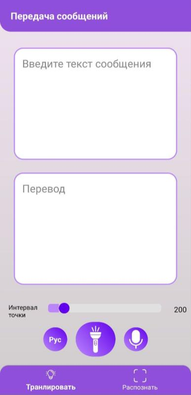
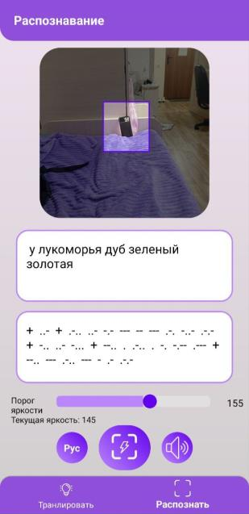

  <h3 align="center">Распознаватель и транслятор Азбуки Морзе</h3>

## О проекте

Приложение предназначено трансляции и распознавания текста с 
использованием азбуки Морзе. Приложение поддерживает: 

* текстовый и голосовой ввод на русском и английском языке
* передачу кода через световую вспышку фонариком
* обратное распознавание с помощью камеры на основе анализа яркости
* настройка длительности сигнала и  обработка возможных ошибок, связанных 
с качеством изображения или производительностью устройства.

    
    

### Требования
- мобильное устройство с операционной системой Android версии не ниже 
7.0:
- наличие вспышки на устройстве (для передачи сигнала);
- встроенная камера;
- микрофон;
- разрешения: доступ к камере и микрофону;
- соединение с интернетом не требуется.
- 
## Использование

После запуска отображается главный экран, разделённый на два основных 
блока:
- фрагмент ввода и трансляции текста;
- фрагмент распознавания сигнала с камеры.
В нижней части каждого экрана можно переключать язык 
(русский/английский) распознавания и трансляции текста.

### Ввод текста и трансляция
- введите текст в текстовое поле, если выбран нужный язык вы увидите ваш 
текст, закодированный кодом Морзе, иначе будут отображены заменяющие 
символы «*»;
- нажмите кнопку трансляции внизу экрана. Если нет разрешения на доступ 
к камере, необходимого для управления фонариком устройства, предоставьте его 
во всплывающем окне, либо в настройках устройства;
- при необходимости остановите передачу повторным нажатием кнопки 
трансляции;
- при необходимости используйте кнопку слайдер в нижней части экрана,
чтобы задать длительность точки для распознавания и трансляции (от 100 до 800
пунктов).
### Голосовой ввод
- нажмите кнопку с микрофоном. Если нет разрешения на доступ к камере, 
предоставьте его во всплывающем окне, либо в настройках устройства;
- начните говорить. По завершении речи система распознает и отобразит 
текст;
- чтобы изменить язык распознавания, нажмите кнопку смены языка, на ней 
отображается текущий выбор (RU / EN);
- после распознавания текст автоматически преобразуется в код Морзе.
### Распознавание кода Морзе из вспышек
- перейдите на экран распознавания;
- включите камеру нажатием на изображение. Если нет разрешения на 
доступ к камере, предоставьте его во всплывающем окне, либо в настройках устройства;
- наведите камеру на источник вспышек(другое устройства с 
установленным приложением и совпадающей скоростей передачи кода);
- на экране отображена выделенная область — при необходимости измените 
её масштаб и позицию касаниями. Второе устройство должно занимать не менее 
50% выбранной области при дневном освещении и 20% в темноте. Данные цифры 
корректируются установкой верного порога яркости вспышки;
- при необходимости смените порог яркости с помощью слайдера в нижней части экрана;
- нажмите кнопку распознавания. Система начнёт анализировать 
изображение и отобразит расшифрованный текст.
### Возможные уведомления и ошибки
- слабое освещение или низкое число кадров в секунду: выводится 
уведомление с рекомендацией изменить параметр, отвечающий за время одного 
символа. Перейдите на экран трансляции и увеличьте это время слайдером 
(необходимо также увеличить значение и на втором устройстве);
- короткие световые вспышки: пользователь получает уведомление, если 
сигнал слишком короткий и может быть пропущен. Система автоматически 
увеличит порог яркости вспышки.
